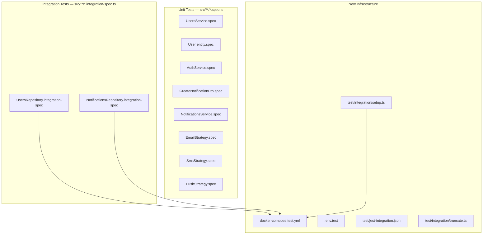

# Test Suite Design

## Architecture at a glance



## New files to create

### Infrastructure

**`docker-compose.test.yml`**

- Single `postgres-test` service, image `postgres:16-alpine`
- Host port `5433` to avoid collision with dev DB on `5432`
- No persistent volume — ephemeral by design

**`.env.test`**

- `NODE_ENV=test`, `POSTGRES_HOST=localhost`, `POSTGRES_HOST_PORT=5433`
- `POSTGRES_DB=thc_test`, `POSTGRES_USER`, `POSTGRES_PASSWORD` (test-only credentials)
- `JWT_SECRET=test-secret`, `JWT_EXPIRES_IN=1d`

**`test/jest-integration.json`**

- `rootDir: "src"`, `testRegex: "\\.integration-spec\\.ts$"`
- `globalSetup`: points to `test/integration/setup.ts` for running migrations
- `runInBand: true` (sequential execution for DB isolation)

**`test/integration/setup.ts`** — global setup

- Loads `.env.test`, creates a TypeORM `DataSource`, runs all migrations programmatically, then destroys the connection

**`test/integration/truncate.ts`** — shared helper

- Exports `truncateAll(dataSource)` that runs `TRUNCATE users, notifications RESTART IDENTITY CASCADE`
- Called in `afterEach` in every integration test

**`package.json` scripts to add**

```
"test:unit":        "jest"
"test:integration": "jest --config ./test/jest-integration.json"
```

---

## Unit Tests — `src/**/*.spec.ts`

### [`src/notifications/services/notifications.service.spec.ts`](src/notifications/services/notifications.service.spec.ts)

Mocks: `strategiesByChannel` map, `notificationsRepository`

- `create()` — dispatches to the EMAIL strategy and saves to repo with `status: SENT`
- `create()` — dispatches to the SMS strategy (same structural assertion)
- `create()` — dispatches to the PUSH strategy (same structural assertion)
- `create()` — throws `BadRequestException` when channel has no strategy entry
- `update()` — throws `NotFoundException` when repo returns `null`
- `remove()` — throws `NotFoundException` when repo returns `false`

### [`src/notifications/strategies/email-notification.strategy.spec.ts`](src/notifications/strategies/email-notification.strategy.spec.ts)

Mock: `IEmailClient`

- `send()` — calls `emailClient.send()` with `{ to: recipient, subject: title, htmlBody: <built template> }`
- `send()` — `htmlBody` wraps title in `<h1>` and content in `<p>`
- `send()` — escapes `<`, `>`, `&`, `"` in title and content (XSS invariant — no mock needed for `buildTemplate`)
- `send()` — throws `BadRequestException` when `dto.channel !== 'email'`

### [`src/notifications/strategies/sms-notification.strategy.spec.ts`](src/notifications/strategies/sms-notification.strategy.spec.ts)

Mock: `ISmsClient`

- `send()` — calls `smsClient.send()` with `{ to: recipient, body: content }`
- `send()` — throws `BadRequestException` when `dto.channel !== 'sms'`

### [`src/notifications/strategies/push-notification.strategy.spec.ts`](src/notifications/strategies/push-notification.strategy.spec.ts)

Mock: `IPushClient`

- `send()` — calls `pushClient.send()` with `{ deviceToken: recipient, title, body: content }`
- `send()` — throws `BadRequestException` when `dto.channel !== 'push'`

### [`src/notifications/dtos/create-notification.dto.spec.ts`](src/notifications/dtos/create-notification.dto.spec.ts)

Uses `class-transformer` + `class-validator` directly (no mocks needed)

- `channel: 'email'` + non-email recipient → validation fails (proves `@Type()` discriminator selects `CreateEmailDto`)
- `channel: 'sms'` + content > 160 chars → validation fails (proves `CreateSmsDto` is selected)
- `channel: 'push'` + recipient < 32 chars → validation fails (proves `CreatePushDto` is selected)
- Valid email payload → validation passes

### [`src/users/services/users.service.spec.ts`](src/users/services/users.service.spec.ts)

Mock: `UsersRepository`

- `create()` — throws `ConflictException` when `findByEmail` returns an existing user
- `create()` — calls `repo.create()` with `{ email, password }` when email is free
- `getByEmail()` — returns `null` when repo returns `null`

### [`src/users/entities/user.entity.spec.ts`](src/users/entities/user.entity.spec.ts)

No mocks — pure entity behavior

- `hashPasswordBeforeInsert()` — the stored password is not equal to the plaintext input
- `hashPasswordBeforeInsert()` — `bcrypt.compare(plain, stored)` resolves to `true`

### [`src/auth/services/auth.service.spec.ts`](src/auth/services/auth.service.spec.ts)

Mocks: `UsersService`, `JwtService`

- `validateUser()` — returns `null` when `getByEmail` returns `null`
- `validateUser()` — returns `null` when password does not match the hash
- `validateUser()` — returns an `AuthenticatedUser` (with `id`, `email`) on valid credentials
- `login()` — calls `jwtService.sign()` with `{ sub: user.id, email: user.email }`

---

## Integration Tests — `src/**/*.integration-spec.ts`

Each test file:

1. Uses a `beforeAll` to connect a TypeORM `DataSource` pointed at the test DB (migrations already run by `globalSetup`)
2. Uses `afterEach` to call `truncateAll()` — clean state between every test
3. Uses `afterAll` to close the `DataSource`

### [`src/users/repositories/users.repository.integration-spec.ts`](src/users/repositories/users.repository.integration-spec.ts)

- `create()` — user row is persisted; `findByEmail()` returns it
- `create()` — password column contains a bcrypt hash, not the plaintext input (proves `@BeforeInsert()` fires via TypeORM lifecycle)
- `findByEmail()` — returns `null` for unknown email
- `findById()` — returns `null` for unknown id

### [`src/notifications/repositories/notifications.repository.integration-spec.ts`](src/notifications/repositories/notifications.repository.integration-spec.ts)

Each test seeds a `User` row first via the TypeORM repo directly.

- `create()` — notification row is persisted with all fields (`title`, `content`, `channel`, `recipient`, `status`)
- `findAllByUserId()` — returns only notifications belonging to that user; does not return another user's notifications (ownership isolation)
- `updateByIdAndUserId()` — updates the record and returns the updated entity
- `updateByIdAndUserId()` — returns `null` when the notification belongs to a different user (ownership enforcement)
- `deleteByIdAndUserId()` — deletes the record and returns `true`
- `deleteByIdAndUserId()` — returns `false` when the notification belongs to a different user (ownership enforcement)
