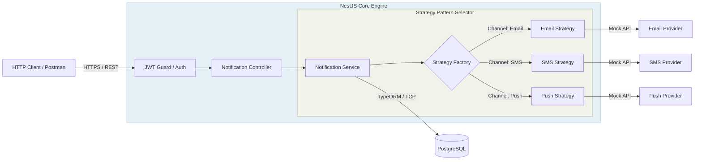
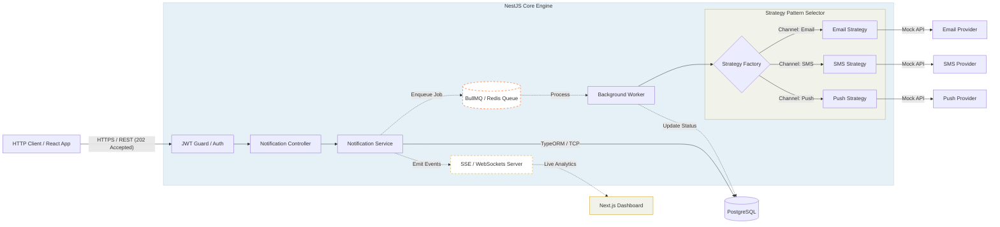

# Version 1

```mermaid
flowchart LR
 subgraph Strategy_Pattern["Strategy Pattern Selector"]
        Strategy{"Strategy Factory"}
        Service["Notification Service"]
        Email["Email Strategy"]
        SMS["SMS Strategy"]
        Push["Push Strategy"]
  end
 subgraph NestJS_Core_Engine["NestJS Core Engine"]
        Controller["Notification Controller"]
        Auth["JWT Guard / Auth"]
        Strategy_Pattern
  end
    Client["HTTP Client / Postman"] -- HTTPS / REST --> Auth
    Auth --> Controller
    Controller --> Service
    Service --> Strategy
    Strategy -- Channel: Email --> Email
    Strategy -- Channel: SMS --> SMS
    Strategy -- Channel: Push --> Push
    Service -- TypeORM / TCP --> DB[("PostgreSQL")]
    Email -- Mock API --> Provider1["Email Provider"]
    SMS -- Mock API --> Provider2["SMS Provider"]
    Push -- Mock API --> Provider3["Push Provider"]

    style Strategy_Pattern fill:#f1f2ea,stroke:#cfd2c1,stroke-width:2px
    style NestJS_Core_Engine fill:#e6f1f7,stroke:#bcd1db,stroke-width:1px
```

# Version 2

```mermaid
flowchart LR
    %% Clientes y Entrada
    Client["HTTP Client / React App"] -- "HTTPS / REST (202 Accepted)" --> Auth

    subgraph NestJS_Core_Engine["NestJS Core Engine"]
        Auth["JWT Guard / Auth"] --> Controller["Notification Controller"]
        Controller --> Service["Notification Service"]

        %% Fase 2: Desacoplamiento y Real-Time
        Queue[("BullMQ / Redis Queue")]
        Worker["Background Worker"]
        StreamServer["SSE / WebSockets Server"]

        subgraph Strategy_Pattern["Strategy Pattern Selector"]
            Strategy{"Strategy Factory"}
            Email["Email Strategy"]
            SMS["SMS Strategy"]
            Push["Push Strategy"]
        end

        %% Flujo de Proceso Asíncrono
        Service -.->|Enqueue Job| Queue
        Queue -.->|Process| Worker
        Worker --> Strategy

        %% Flujo de Real-Time
        Service -.->|Emit Events| StreamServer
    end

    %% Relaciones de la Estrategia
    Strategy -- Channel: Email --> Email
    Strategy -- Channel: SMS --> SMS
    Strategy -- Channel: Push --> Push

    %% Persistencia y Terceros
    Service -- TypeORM / TCP --> DB[("PostgreSQL")]
    Worker -.->|Update Status| DB
    Email -- Mock API --> Provider1["Email Provider"]
    SMS -- Mock API --> Provider2["SMS Provider"]
    Push -- Mock API --> Provider3["Push Provider"]

    %% Monitoreo en Tiempo Real (Fase 2)
    StreamServer -.->|Live Analytics| Dashboard["Next.js Dashboard"]

    %% Estilos solicitados por el usuario
    style Strategy_Pattern fill:#f1f2ea,stroke:#cfd2c1,stroke-width:2px
    style NestJS_Core_Engine fill:#e6f1f7,stroke:#bcd1db,stroke-width:1px

    %% Estilos adicionales para resaltar componentes de Fase 2
    style Queue fill:#fff,stroke:#f96,stroke-width:2px,stroke-dasharray: 5 5
    style StreamServer fill:#fff,stroke:#d4a017,stroke-dasharray: 5 5
    style Dashboard fill:#f1f2ea,stroke:#d4a017,stroke-width:1pxc
```
