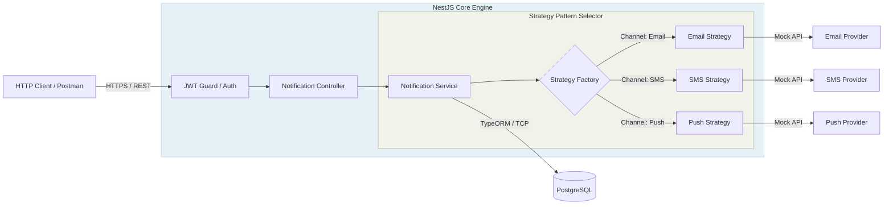

# Version 1

```mermaid
flowchart LR
 subgraph Strategy_Pattern["Strategy Pattern Selector"]
        Strategy{"Strategy Factory"}
        Service["Notification Service"]
        Email["Email Strategy"]
        SMS["SMS Strategy"]
        Push["Push Strategy"]
  end
 subgraph NestJS_Core_Engine["NestJS Core Engine"]
        Controller["Notification Controller"]
        Auth["JWT Guard / Auth"]
        Strategy_Pattern
  end
    Client["HTTP Client / Postman"] -- HTTPS / REST --> Auth
    Auth --> Controller
    Controller --> Service
    Service --> Strategy
    Strategy -- Channel: Email --> Email
    Strategy -- Channel: SMS --> SMS
    Strategy -- Channel: Push --> Push
    Service -- TypeORM / TCP --> DB[("PostgreSQL")]
    Email -- Mock API --> Provider1["Email Provider"]
    SMS -- Mock API --> Provider2["SMS Provider"]
    Push -- Mock API --> Provider3["Push Provider"]

    style Strategy_Pattern fill:#f1f2ea,stroke:#cfd2c1,stroke-width:2px
    style NestJS_Core_Engine fill:#e6f1f7,stroke:#bcd1db,stroke-width:1px
```

# Version 2
