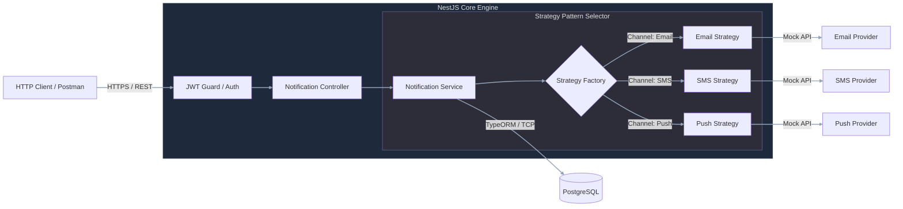
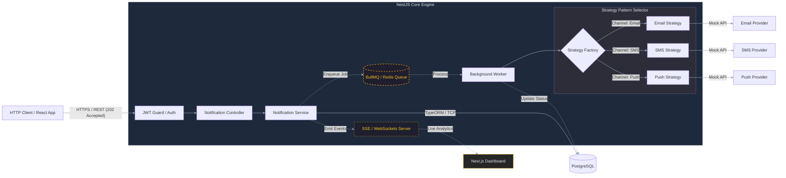

# Phase 1

```mermaid
flowchart LR
 subgraph Strategy_Pattern["Strategy Pattern Selector"]
        Strategy{"Strategy Factory"}
        Service["Notification Service"]
        Email["Email Strategy"]
        SMS["SMS Strategy"]
        Push["Push Strategy"]
 end
 subgraph NestJS_Core_Engine["NestJS Core Engine"]
        Controller["Notification Controller"]
        Auth["JWT Guard / Auth"]
        Strategy_Pattern
 end
    Client["HTTP Client / Postman"] -- HTTPS / REST --> Auth
    Auth --> Controller
    Controller --> Service
    Service --> Strategy
    Strategy -- "Channel: Email" --> Email
    Strategy -- "Channel: SMS" --> SMS
    Strategy -- "Channel: Push" --> Push
    Service -- TypeORM / TCP --> DB[("PostgreSQL")]
    Email -- Mock API --> Provider1["Email Provider"]
    SMS -- Mock API --> Provider2["SMS Provider"]
    Push -- Mock API --> Provider3["Push Provider"]

    %% Estilos optimizados para modo oscuro
    style Strategy_Pattern fill:#2d2d3a,stroke:#4a4a6a,stroke-width:2px,color:#e0e0e0
    style NestJS_Core_Engine fill:#1e293b,stroke:#334155,stroke-width:1px,color:#e0e0e0

    %% Opcional: Estilo global para nodos si es necesario
    linkStyle default stroke:#94a3b8,stroke-width:2px
```

# Phase 2

```mermaid
flowchart LR
    %% Clientes y Entrada
    Client["HTTP Client / React App"] -- "HTTPS / REST (202 Accepted)" --> Auth

    subgraph NestJS_Core_Engine["NestJS Core Engine"]
        Auth["JWT Guard / Auth"] --> Controller["Notification Controller"]
        Controller --> Service["Notification Service"]

        %% Fase 2: Desacoplamiento y Real-Time
        Queue[("BullMQ / Redis Queue")]
        Worker["Background Worker"]
        StreamServer["SSE / WebSockets Server"]

        subgraph Strategy_Pattern["Strategy Pattern Selector"]
            Strategy{"Strategy Factory"}
            Email["Email Strategy"]
            SMS["SMS Strategy"]
            Push["Push Strategy"]
        end

        %% Flujo de Proceso Asíncrono
        Service -.->|Enqueue Job| Queue
        Queue -.->|Process| Worker
        Worker --> Strategy

        %% Flujo de Real-Time
        Service -.->|Emit Events| StreamServer
    end

    %% Relaciones de la Estrategia
    Strategy -- "Channel: Email" --> Email
    Strategy -- "Channel: SMS" --> SMS
    Strategy -- "Channel: Push" --> Push

    %% Persistencia y Terceros
    Service -- "TypeORM / TCP" --> DB[("PostgreSQL")]
    Worker -.->|Update Status| DB
    Email -- Mock API --> Provider1["Email Provider"]
    SMS -- Mock API --> Provider2["SMS Provider"]
    Push -- Mock API --> Provider3["Push Provider"]

    %% Monitoreo en Tiempo Real (Fase 2)
    StreamServer -.->|Live Analytics| Dashboard["Next.js Dashboard"]

    %% Estilos optimizados para modo oscuro

    %% Contenedores principales
    style NestJS_Core_Engine fill:#1e293b,stroke:#475569,stroke-width:1px,color:#e2e8f0
    style Strategy_Pattern fill:#2d2d3a,stroke:#4a4a6a,stroke-width:2px,color:#e2e8f0

    %% Componentes Fase 2 (Dashed/Alert)
    style Queue fill:#1e1e2e,stroke:#f59e0b,stroke-width:2px,stroke-dasharray: 5 5,color:#fbbf24
    style StreamServer fill:#1e1e2e,stroke:#eab308,stroke-dasharray: 5 5,color:#facc15
    style Dashboard fill:#262626,stroke:#eab308,stroke-width:1px,color:#e2e8f0

    %% Estilos de enlaces para contraste
    linkStyle default stroke:#94a3b8,stroke-width:1.5px
```

