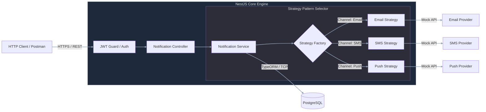

# Concurrent Notification Hub — Core V1

[](https://github.com/andrescasa-dev/concurrent-notification-hub/actions/workflows/ci.yml)
[](https://coveralls.io/github/andrescasa-dev/concurrent-notification-hub?branch=main)

> [!NOTE]
> **Transparency disclaimer**  
> While all architectural and technical decisions were entirely mine, I utilized Claude and Cursor to accelerate the development phase. The AI assisted with implementing boilerplate code, refactors, writing tests, and generating documentation. I am sharing this openly so reviewers can evaluate both the design choices and the modern workflow used to produce them.

**Project highlights (Phase 1)**

- [Decisions taken](#decisions-taken)
- [Future enhancements](#future-enhancements)
- [Quick start](#quick-start)

**Phase 1 (implemented today):** synchronous NestJS core with pluggable channel strategies. The diagram below reflects the **current** request flow.



Further detail: [ARCHITECTURE.md — Phase 1](./ARCHITECTURE.md#phase-1).

---

## System Overview & Problem Solved

Enterprise applications often scatter messaging logic across services—duplicate validation, inconsistent security boundaries, and channel-specific code that breaks the **Open/Closed** principle whenever a new provider appears.

In **Phase 1**, this engine **centralizes** authenticated users’ notification lifecycle (create, update, delete, list) and **dispatches** alerts across **Email, SMS, and Push** through a single synchronous API surface. Encapsulation keeps channel rules behind stable architectural boundaries; JWT-backed guards ensure only authenticated identities mutate or trigger sends, reducing fragmentation and long-term technical debt in downstream apps.

---

## Decisions taken

Brief rationale for the main Phase 1 design choices. Expand each item for details.

<details>
  <summary><b>testing - Pragmatic testing + dedicated integration database</b></summary>

**Problem:** Mocking everything gives fast tests but misses migration bugs, constraints, and real query behavior; sharing the dev database with tests causes flaky runs and polluted local data.

**Decision:** Tests are split by **architectural boundary** so failures pinpoint the layer at fault:

| Suite | Scope | Isolation |
| --- | --- | --- |
| **Unit** (`pnpm test`) | Strategy rules, services, guards—business logic without I/O | In-memory mocks; `test/jest/unit.config.cjs` |
| **E2E** (`pnpm test:e2e`) | Full HTTP cycle: auth, JWT, CRUD, send, real Postgres | Dedicated DB on port **5433**; migrations via `test/utils/setup.ts`; `test/jest/e2e.json` |

**Dev** Postgres (`docker-compose.yml`, port **5432**) and **test** Postgres (`docker-compose.test.yml`, port **5433**) use separate Compose project names so `down` on the test stack does not destroy dev data. Run all: `pnpm test:all`. Coverage: `pnpm test:cov`. With Docker: `./up_test.sh`.

</details>

<details>
  <summary><b>feature - Clean architecture (layers and client boundary)</b></summary>

**Problem:** Mixing HTTP, business rules, SQL, and third-party HTTP calls in one module creates tight coupling and makes the system hard to test or evolve.

**Decision:** The codebase follows a **clean, layered layout**: controllers handle HTTP, services orchestrate use cases, repositories isolate persistence, strategies own channel-specific send rules, and a dedicated **client layer** (`clients/email`, `clients/sms`, `clients/push`) talks to external providers behind interfaces (`IEmailClient`, `ISmsClient`, `IPushClient`). Inward dependencies point at abstractions; infrastructure stays at the edges.

</details>

<details>
  <summary><b>feature - Strategy pattern (notification channels)</b></summary>

**Problem:** Channel logic tends to accumulate in a single service (`if channel === email …`) so every new provider forces edits to existing code and violates the **Open/Closed** principle.

**Decision:** Each channel (Email, SMS, Push) is a `NotificationSendingStrategy`. The service resolves the implementation from `channel` and calls `send()` without knowing provider details. New channels are added by registering another strategy, not by branching in the core.

</details>

<details>
  <summary><b>feature - Discriminated DTO (<code>channel</code> + <code>notification</code>)</b></summary>

**Problem:** A single flat body cannot enforce different required fields per channel (recipient email vs. phone vs. device token) without leaking validation into the service layer.

**Decision:** `CreateNotificationDto` carries a `channel` discriminator and a nested `notification` object whose class is selected at runtime (`CreateEmailDto`, `CreateSmsDto`, `CreatePushDto`). Validation and Swagger `oneOf` stay aligned with the chosen channel before any strategy runs.

</details>

<details>
  <summary><b>feature - Simulated providers (client layer)</b></summary>

**Problem:** Wiring real Gmail, Twilio, or FCM in a take-home adds API keys, network flakiness, and review friction without proving stronger Node/Nest design skills.

**Decision:** External sends go through the **client layer** with **simulated implementations** (`SimulatedGmailEmailClient`, `SimulatedSmsClient`, `SimulatedPushClient`) that return deterministic IDs and log behavior. Strategies still exercise real channel rules (validation, templates, length limits). The goal is to demonstrate architecture and Node expertise—not to ship production traffic. Swapping in real clients later is a module binding change, not a rewrite of strategies or services.

</details>

<details>
  <summary><b>feature - Passport (authentication)</b></summary>

**Problem:** Hand-rolled auth in controllers couples HTTP handlers to one login mechanism and makes it costly to add OAuth, API keys, or other flows later.

**Decision:** **Passport** with pluggable strategies—`LocalStrategy` for sign-in, `JwtStrategy` for protected routes—keeps verification in one place. Guards stay thin; swapping or extending auth means a new strategy, not rewriting business code. Protected notification routes are scoped to the authenticated owner.

</details>

<details>
  <summary><b>feature - Repository layer (persistence)</b></summary>

**Problem:** Services that call TypeORM directly are hard to unit-test and tightly bound to SQL/ORM details, which increases friction when persistence needs to change.

**Decision:** Domain services depend on `UsersRepository` and `NotificationsRepository` interfaces, injected via tokens, with TypeORM implementations behind them. Persistence queries live at the boundary; services express intent (`findAllByUserId`, `updateByIdAndUserId`) without ORM leakage.

</details>

<details>
  <summary><b>feature - Controlled migrations (<code>synchronize: false</code>)</b></summary>

**Problem:** Letting the ORM auto-sync schema in production risks silent drift, data loss, and environments that do not match each other.

**Decision:** **PostgreSQL** schema evolves only through **versioned TypeORM migrations** checked into the repo. `synchronize: false` keeps the database state explicit and reviewable; dev, test, and CI apply the same migration chain (`pnpm migration:run`) so schema integrity is a deliberate act, not a side effect of booting the app.

</details>

<details>
  <summary><b>docs - Swagger / live API documentation</b></summary>

**Problem:** Undocumented APIs become tribal knowledge; handwritten specs drift from code.

**Decision:** **OpenAPI/Swagger** is generated from NestJS decorators and served at **`/docs`** when the app is running. Documentation stays in sync with the implementation—no separate spec files to maintain by hand. It is treated as part of the product surface for onboarding, client integration, and reviewing channel-specific payloads.

</details>

<details>
  <summary><b>feature - URI versioning (<code>/v1/...</code>)</b></summary>

**Problem:** Breaking changes on a single unversioned API force all consumers to upgrade in lockstep.

**Decision:** NestJS **URI versioning** with `v1` as the default path prefix (e.g. `/v1/notifications`). Clients pin a stable contract; future versions can coexist without implicit breaking changes.

</details>

<details>
  <summary><b>CI/CD - Git hooks (Husky + lint-staged)</b></summary>

**Problem:** Without local checks, unformatted or lint-failing code can reach the remote before CI catches it, slowing review and breaking the pipeline.

**Decision:** **Husky** runs a **pre-commit** hook that invokes **lint-staged** on staged files only. Each matching file is formatted with **Prettier** (`--write`) and linted with **ESLint** (`--fix`); fixes are re-staged automatically. Hooks install on `pnpm install` via the `prepare` script. Full-repo checks remain available with `pnpm format` and `pnpm lint`; CI still runs the complete lint and test suite.

</details>

<details>
  <summary><b>CI/CD - GitHub Actions + Coveralls</b></summary>

**Problem:** Without automated checks, regressions reach main and environments diverge from what was reviewed locally.

**Decision:** Continuous integration on **GitHub Actions** ([`.github/workflows/ci.yml`](.github/workflows/ci.yml)). On every push to `main` and on pull requests, the pipeline installs with `pnpm install --frozen-lockfile`, runs ESLint, builds with `pnpm build`, executes `pnpm test:cov` (unit + e2e against Postgres 16), and uploads coverage to **Coveralls**. CI and coverage badges are shown at the top of this README.

</details>

<details>
  <summary><b>quick start - Docker quick-start scripts (<code>up_dev.sh</code> / <code>up_test.sh</code>)</b></summary>

**Problem:** Requiring Node, pnpm, local Postgres, env files, and manual migration commands raises the barrier for reviewers and hides environment drift between machines.

**Decision:** Added bash entrypoints—`./up_dev.sh` (API + Postgres + migrations) and `./up_test.sh` (test Postgres + full suite)—wired through Docker Compose overrides. The **only requirement** to run the app or tests is **Docker** (and Compose v2); no local Node toolchain needed. See [Quick start](#quick-start).

</details>

---

## Technical Stack

| Layer                        | Technologies                                                                       |
| ---------------------------- | ---------------------------------------------------------------------------------- |
| **Backend Core**             | Node.js 24, NestJS 11, TypeScript, Passport (JWT / Local), class-validator, Helmet |
| **Database & Persistence**   | PostgreSQL 16, TypeORM, programmatic migrations                                    |
| **Dev Quality & Automation** | pnpm, Jest, ESLint, Prettier, Husky, lint-staged, GitHub Actions, Coveralls, Docker Compose, TypeORM CLI (`migration:`\* scripts) |

---

## Future enhancements

**Not implemented in Phase 1.** Planned improvements at a high level:

- **Phase 2 architecture** — async job processing, background workers, and real-time event streaming layered on the same Strategy boundaries ([diagram](./ARCHITECTURE.md#phase-2))
- **Real external providers** — replace simulated clients with production Email/SMS/Push integrations
- **Operations dashboard** — UI for monitoring sends under high volume
- **Rate limiting and delivery retries** — resilience when provider APIs throttle or fail

---

## Quick start

**Requirements:** [Docker](https://docs.docker.com/get-docker/) and Docker Compose v2 only.

### Run app with Docker

```bash
chmod +x ./up_dev.sh
./up_dev.sh
```

- Migrations run automatically, then the API listens on **[http://localhost:3000](http://localhost:3000)**
- **Swagger:** [http://localhost:3000/docs](http://localhost:3000/docs)
- Auth is **JWT**: register via `POST /v1/users`, sign in via `POST /v1/auth/login`, then use **Authorize** in Swagger with `Bearer <access_token>`, or call the API with curl/Postman
- Press **Ctrl+C** to stop the app

### Run tests with Docker

From the project root:

```bash
chmod +x ./up_test.sh
./up_test.sh
```

Runs `pnpm test:all` (unit + e2e) inside a container against the test Postgres service, then exits when the suite finishes.
